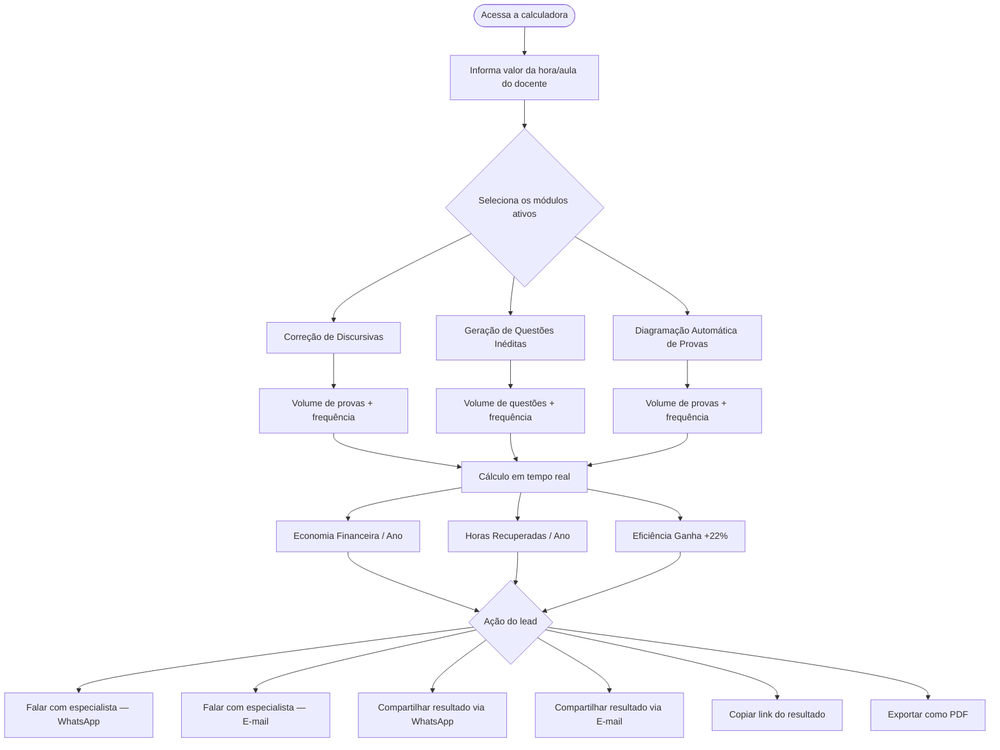
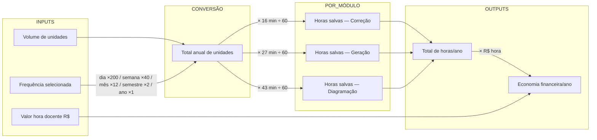
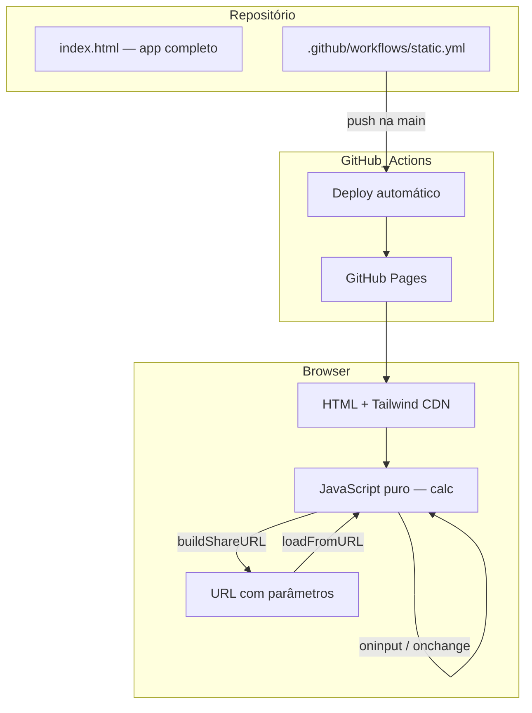
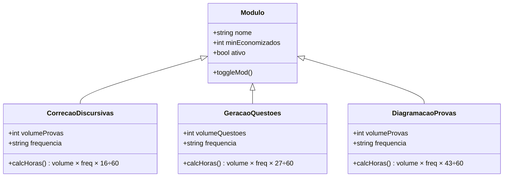
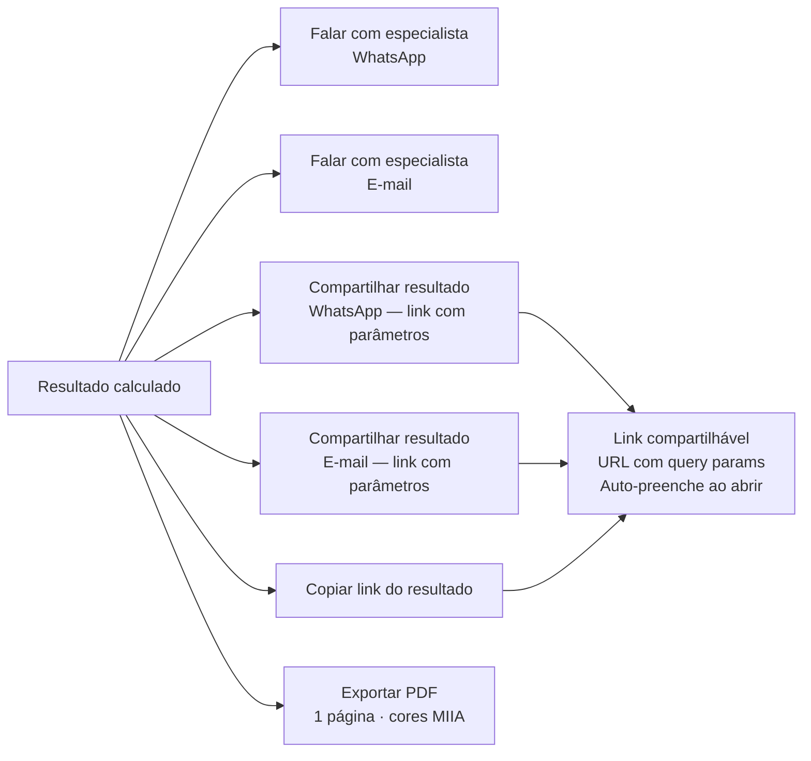

# Calculadora de ROI · MIIA

Ferramenta de cálculo de retorno sobre investimento para instituições de ensino que avaliam a adoção das soluções de IA da [MIIA](https://miia.tech). O lead preenche os dados da sua instituição e recebe em tempo real a estimativa de horas recuperadas e economia financeira anual.

**Deploy:** [gustavo130803.github.io/calculadora-miia](https://gustavo130803.github.io/calculadora-miia/)

---

## Fluxo do usuário



---

## Lógica de cálculo



---

## Arquitetura



---

## Módulos disponíveis



---

## Ações disponíveis após o cálculo



---

## Stack

| Camada | Tecnologia |
|---|---|
| Frontend | HTML5 + CSS3 + JavaScript vanilla |
| Estilo | Tailwind CSS via CDN |
| Fontes | Google Fonts — Montserrat (números/títulos) + Sora (corpo) |
| Hospedagem | GitHub Pages (gratuito) |
| CI/CD | GitHub Actions — deploy automático no push |

---

## Como rodar localmente

```bash
# Sem build necessário — abra direto no browser
open index.html
```

Ou use o Live Server do VS Code para hot reload.
