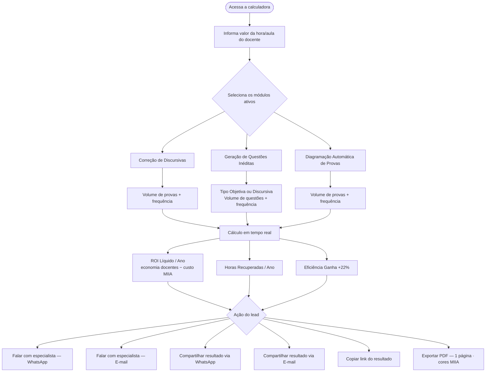
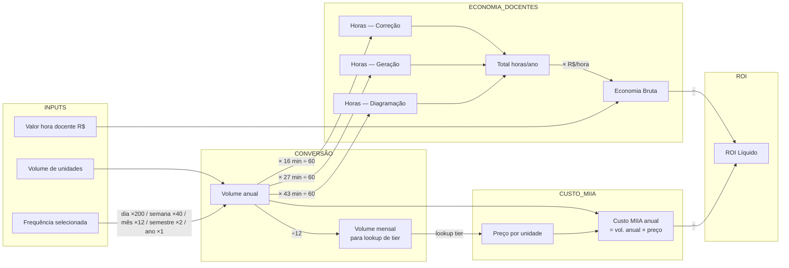
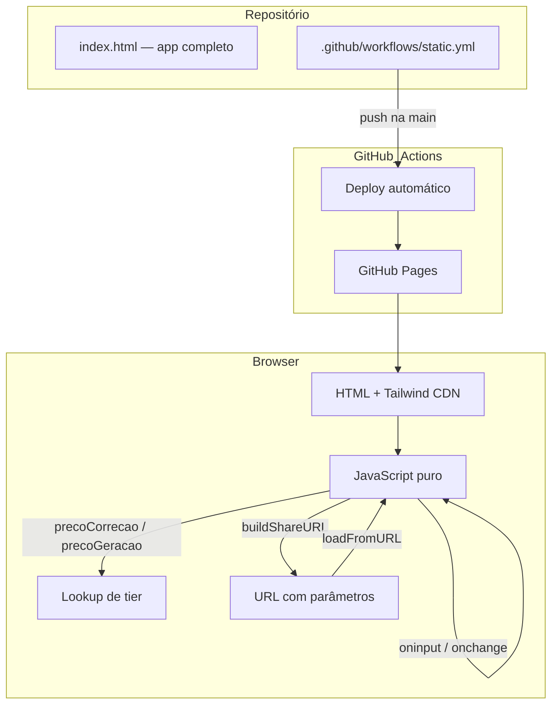
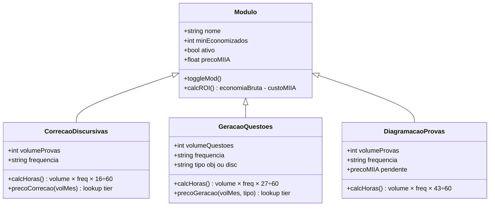

# Calculadora de ROI · MIIA

Ferramenta de cálculo de retorno sobre investimento para instituições de ensino que avaliam a adoção das soluções de IA da [MIIA](https://miia.tech). O lead preenche os dados da sua instituição e recebe em tempo real o **ROI líquido** — economia com docentes menos o custo dos serviços MIIA.

**Deploy:** [gustavo130803.github.io/calculadora-miia](https://gustavo130803.github.io/calculadora-miia/)

---

## Fluxo do usuário



---

## Lógica de cálculo



---

## Tabelas de preço MIIA

### Correção de Discursivas — R$/prova (tier por volume mensal)

| Volume mensal | R$/prova |
|---|---|
| até 15.000 | R$ 1,60 |
| 15.001 – 30.000 | R$ 1,30 |
| 30.001 – 60.000 | R$ 1,00 |
| 60.001 – 90.000 | R$ 0,80 |
| 90.001 – 300.000 | R$ 0,65 |
| 300.001 – 600.000 | R$ 0,60 |
| 600.001 – 1.000.000 | R$ 0,50 |
| acima de 1.000.000 | R$ 0,45 |

### Geração de Questões — R$/questão (tier por volume mensal)

| Volume mensal | Objetiva | Discursiva |
|---|---|---|
| até 1.000 | R$ 10,00 | R$ 20,00 |
| 1.001 – 2.000 | R$ 8,50 | R$ 17,00 |
| 2.001 – 3.000 | R$ 7,00 | R$ 14,00 |
| 3.001 – 5.000 | R$ 5,50 | R$ 11,00 |
| 5.001 – 7.000 | R$ 4,00 | R$ 8,00 |
| 7.001 – 10.000 | R$ 3,00 | R$ 6,00 |
| acima de 10.000 | R$ 2,50 | R$ 5,00 |

> **Diagramação:** preço ainda não cadastrado — custo MIIA não deduzido neste módulo.

---

## Arquitetura



---

## Módulos disponíveis



---

## Stack

| Camada | Tecnologia |
|---|---|
| Frontend | HTML5 + CSS3 + JavaScript vanilla |
| Estilo | Tailwind CSS via CDN |
| Fontes | Google Fonts — Montserrat (números/títulos) + Sora (corpo) |
| Hospedagem | GitHub Pages (gratuito) |
| CI/CD | GitHub Actions — deploy automático no push |

---

## Como rodar localmente

```bash
# Sem build necessário — abra direto no browser
open index.html
```

Ou use o Live Server do VS Code para hot reload.
